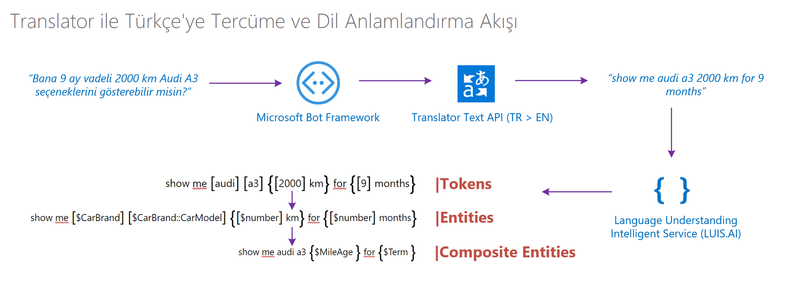
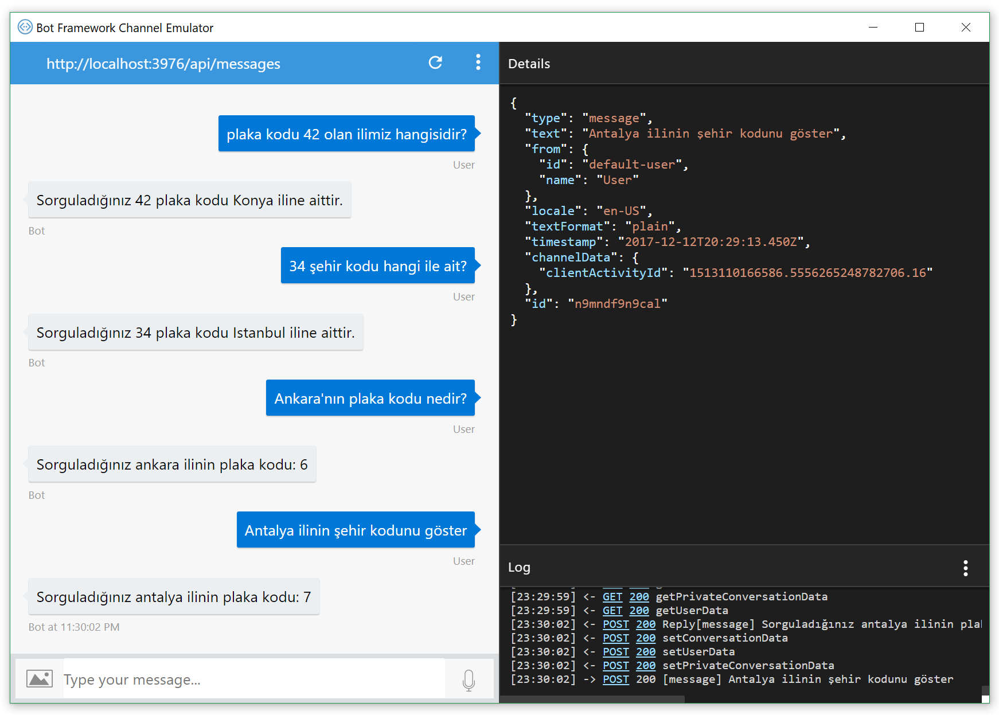

# Şehir-Plaka Kodu Arama - LUIS'e TÜRKÇE Doğal Dil Anlama Özelliği Ekleme

Geliştiricilerin son zamanlarda en çok konuştuğu konu olan ChatBot uygulamalarına, zeki özelliklerin nasıl katılacağını göreceğimiz örneklerle devam ediyoruz. ChatBot serimizin ilk iki yazısını kaçıranlar 
* ilk yazıyı  [Şehir-Plaka kodu arama projesi](https://github.com/ikivanc/TRPlateBot) 
* ikinci yazıyı [Şehir-Plaka kodu arama projesi-LUIS Entegrasyonu](https://github.com/ikivanc/TRPlateBot-LUIS) okuyabilir.

Bu yazıda ise İngilizce haricinde kendi dilinizde anlayan bir chatbot nasıl entegre edileceğini birlikte inceleyeceğiz. İkinci yazımızda gördüğümüz Doğal Dil İşleme ve Anlama servisi olan LUIS.AI entegre edildikten sonra LUIS tarafından şu anda desteklenmeyen Türkçe dil anlama özelliğinin eklenmesini birlikte inceleyelim.

Temelinde ingilizceye tercüme edilen cümlelerde LUIS'in sadece hangi method'un çalışmasını bulacağı ``Intent`` ve bu methodun içerisinde hangi parametreyi göndereceği ``Entity`` 'leri bulmamız gerekecek. Bunu da yapmamızı sağlayacak en önemli araçlardan birisi de Translator olacaktır.

Aşağıda bir araç kiralama sorgusu örneğinde görüldüğü gibi temel amaç ``Token`` adını verdiğimiz cümle içerisinden yakalayabildiğimiz parametrelerin yakalanması.



Bu ``Token``lar haricinde tercümelerde meydana gelecek küçük hatalar, aslında projemizin çalışmasına etki etmeyecektir.

## Azure üzerinden Microsoft Text Translator API Key'i alma
Bu bot örneğimizde Microsoft Translator Text API servisini kullanacağız. Bu servis REST API altyapısı sayesinde ister websitenizde, ister mobil uygulmanızda isterseniz diğer platform uygulamalarında çoklu dil desteği vermeyi sağlayan bir yapıya sahiptir. Tüm cihazlara ve uygulamalara entegre edeceğimiz bu servis hakkında detaylı bilgileri [Microsoft Text Translator API](https://www.microsoft.com/en-us/translator) adresinde bulabilirsiniz.

 

### Microsoft Translator API 'a başlangıç
Microsoft Translator Text API key'ine erişebilmek için Microsoft Azure hesabınız olması gerekiyor, hesap edinmek için aşağıdaki adımları takip edebilirsiniz.
1. Microsoft Azure hesabı oluşturmak için [http://azure.com](http://azure.com) adresine giderek yeni bir hesap oluşturun.
1. Hesabı oluşturduktan sonra [http://portal.azure.com](http://portal.azure.com) adresine erişin.
1. ürünler menüsünden **New** seçeneğini seçin.
1. **AI + Cognitive Services** kategorisini seçin.
1. Sağ üst köşeden **See All** 'a tıklayın.
1. **Translator Text API** seçeneğini seçin.
1. **Create** butonuna tıklayın.
1. Karşınıza çıkan alanları doldurun.
1. **Pricing Tier** bölümünde size uygun olan seçeneği seçin.
1. **Create** butonuna tıklayın.
1. Şu anda Microsoft Translator'a üye olun.
1. **All Resources** içerisinden oluşturduğunuz Translator API'ı seçin.
1. **Keys** bölümünden Key içeriğini alın.

Buradan elde edeceğiniz API key'i projede bulunan `MessagesController.cs` içerisinde aşağıdaki ``ApiKey`` değişkeni içerisine yazarak Microsoft Text Translator ile entegrasyonunu sağlayabilirsiniz..
```cs
    ...
     public class MessagesController : ApiController
     {
        string ApiKey = "MICROSOFT TRANSLATOR API KEY'İNİZİ BURAYA GİRİN";
        string targetLang = "en";
    ...
```


``Post`` methodu altında aşağıda olduğu gibi gelen mesaj direkt olarak translator'a gönderilerek dönen sonucu da LUIS'le anlamlandırılması sağlanmaktadır.

```cs
    ...
  public async Task<HttpResponseMessage> Post([FromBody]Activity activity)
        {
            //Bu parça dil işleme kısmı entegre olunca çalışacak
            #region LUIS Integration 
            if (activity.Type == ActivityTypes.Message)
            {

                ConnectorClient connector = new ConnectorClient(new Uri(activity.ServiceUrl));

                var input = activity.Text;

                Task.Run(async () =>
                {
                    var accessToken = await GetAuthenticationToken(APIKEY);
                    var output = await Translate(input, TRANSLATETO, accessToken);
                    Console.WriteLine(output);
                    activity.Text = output;
                    await Conversation.SendAsync(activity, () => new RootLuisDialog());
                }).Wait();
            }
            else
            {
                HandleSystemMessage(activity);
            }
            var response = Request.CreateResponse(HttpStatusCode.OK);
            return response;
            #endregion
        }
    ...
```

Proje'nin içerisine Authentication aşağıdaki gibi yapılabilmektedir.
```cs
    ...
 
        static async Task<string> GetAuthenticationToken(string key)
        {
            string endpoint = "https://api.cognitive.microsoft.com/sts/v1.0/issueToken";

            using (var client = new HttpClient())
            {
                client.DefaultRequestHeaders.Add("Ocp-Apim-Subscription-Key", key);
                var response = await client.PostAsync(endpoint, null);
                var token = await response.Content.ReadAsStringAsync();
                return token;
            }
        }
    ...
```

Projenin içerisinde REST API ile translate aşağıdaki gibi yapılabilmektedir.

```cs
    ...
 
        static async Task<string> Translate(string textToTranslate, string language, string accessToken)
        {
            string url = "http://api.microsofttranslator.com/v2/Http.svc/Translate";
            string query = $"?text={System.Net.WebUtility.UrlEncode(textToTranslate)}&to={language}&contentType=text/plain";

            using (var client = new HttpClient())
            {
                client.DefaultRequestHeaders.Authorization = new AuthenticationHeaderValue("Bearer", accessToken);
                var response = await client.GetAsync(url + query);
                var result = await response.Content.ReadAsStringAsync();

                if (!response.IsSuccessStatusCode)
                    return "ERROR: " + result;

                var translatedText = XElement.Parse(result).Value;
                return translatedText;
            }
        }
```

Bu entegrasyon sayesinde Türkçe cevap soru soracağınız chatbot'unuz bunu anlamlandırıp istediğiniz Intent'e karşılık gelen methodu çalıştırabilmektedir.


## Tercüme esnasında yanlış algılanan kelimelerin algılanması

Bu entegrasyonda bazı kelimeler Translator tarafından yanlış çevirildiğinde bunları tespit etmek ve düzeltmek için LUIS'e sorgu olarak giden cümleleri kontrol edebiliriz. Intent 'in altında Suggested Utterances bölümünde beliren bu sorgular, kullanıcıların Türkçe sorduğu ve İngilizce olarak sisteme yansıyan cümleler olduğunu göreceğiz. 

Burada yöntemlerden birisi bu çevirileri LUIS içerisinde doğru bir şekilde taglemek sistemi yeniden eğitmek. Bir diğer yöntemse her orjinal sorguyu ve de tercümeyi Azure üzerine kaydederek kullanıcıların sormuş oldukları orjinal mesajları tespit etmek diyebiliriz, bu sayede son kullanıcıların soru yöntemlerini ve kullanımlarını görerek de sistemi yeniden eğitebilirsiniz.


## Kod'un emülatör üzerinde çalışması
Uygulamamızın çıktısı aşağıdaki gibi çalışmaktadır.

 

Bu örnekte de gördüğümüz gibi, LUIS entegre edilmiş bir uygulamamıza Türkçe Dil Desteğinin nasıl eklenebileceğini gördük. Eğer uygulamanızın kapsamı belirli ise bu tür bir implementasyonla hızlı bir şekilde uygulamanızı elde edebilir ve testlere başlayabilirsiniz. Sonuçları tatmin edici seviyede train ettikten (eğittikten) sonra son kullanıcılarınızla da paylaşabilirsiniz.

## Son Söz
Bu 3 yazılık örnek serisinin sonunda, bu tür chatbot projelerinde en önemli nokta senaryoların önceden çıkarılıp, LUIS ile NLP yapılarının bu soruları da kapsayacak şekilde design edilmesi, sonrasında da son kullanıcılardan gelen sorularla sistem eğitilerek zeki bir yapı oluşturulmasıdır.

Sonraki adımlarda daha nokta atışı arama yapabilmek için, Azure Search, Azure Machine Learning  benzeri servisleri entegre ederek sonuçları daha doğru oranlarda son kullanıcılara sunabiliriz.

iyi çalışmalar.